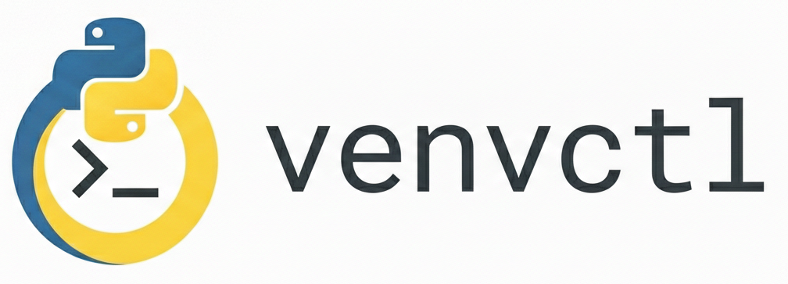

<div align="center">
    
    <h2>VIrtual environment control</h2>
</div>

venvctl (inspired by systemctl) is a lightweight Bash utility to manage Python virtual environments in a fixed directory defined at installation. It simplifies the workflow of creating, listing, and removing environments, ensuring consistency across projects.

## Installation

To install venvctl, just clone this repository and install it using the provided `Makefile`:

```bash
git clone https://github.com/pedronovaes/venvctl.git
cd venvctl
make install
```

By default, all environments will be stored in `~/.venvs`. If you want to customize this directory, specify it during installation:

```bash
sudo make install ENV_DIR=~/projects/envs
```

This will generate a configuration file at `/etc/venvctl.conf`:

```bash
ENV_DIR=/home/pedro/projects/envs
```

Run this command to ensure the installation was successful:

```bash
make verify
```

### Uninstallation

To uninstall, run this command:

```bash
sudo make uninstall
```

This will delete both `/usr/local/bin/venvctl` and `/etc/venvctl.conf`.

## Usage

To create a Python virtual environment, run this command:

```bash
venvctl --name my_env
```

Or run this command, if you want to install some libraries at the same time:

```bash
venvctl --name my_env --req requirements.txt
```

You also can list all virtual environments installed:

```bash
venvctl --list
```

Or delete some virtual environment:

```bash
venvct --delete my_env
```

For more informations, please check the documentation: `venvctl --help`

## Suite tests

Venvctl uses **bats** (Bash Automated Testing System) to run its integration and functionality tests. To run the full test suite locally, install bats and then execute the tests from the project root:

```bash
sudo apt update
sudo apt install bats

make check
```

If you want to run some one specific test and see detailed output, execute this command:

```bash
bats --verbose-run tests/venvctl_tests.bats -f "Creates environment with --name"
```
## Requirements

To install and use this tool, you need:
- Python3
- virtualenv
- make
- sudo
- bats
